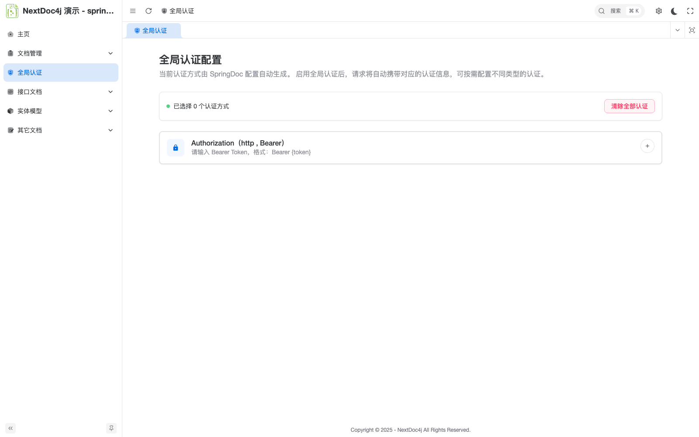
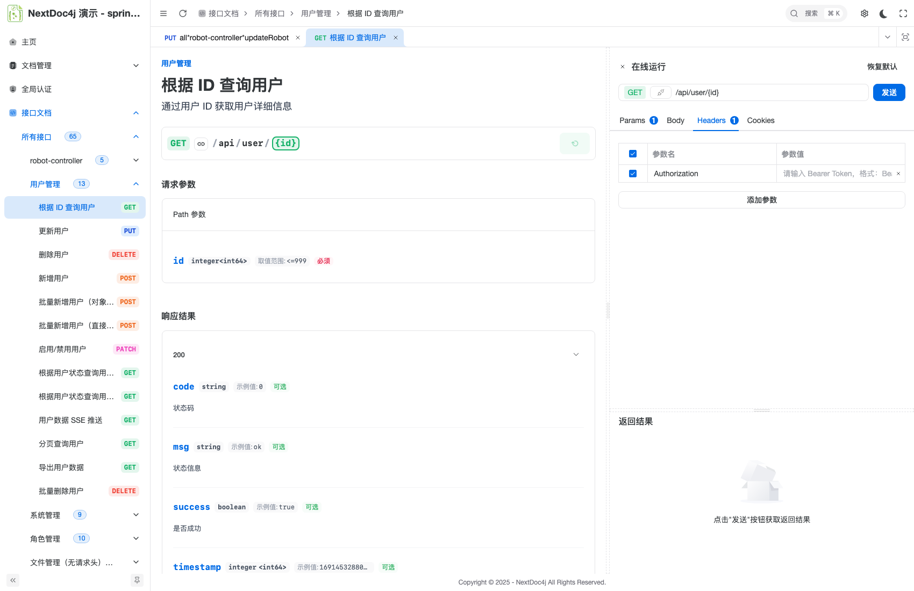

# 认证展示插件

认证展示插件用于在 API 文档中配置全局认证信息，让接口调试工具自动显示认证输入框。

## UI 适配效果

配置插件后 UI 会在接口调试区域显示认证输入框：


*▲ 全局认证输入框*


*▲ 在线调试自动添加全局请求头*

## 快速开始

### 1. 引入依赖

如需使用认证展示插件：

```xml
<dependency>
    <groupId>top.nextdoc4j</groupId>
    <artifactId>nextdoc4j-plugin-security-core</artifactId>
    <version>${latest.version}</version>
</dependency>
```

### 2. 配置 springdoc

```yaml
springdoc:
  ## 组件配置
  components:
    # 鉴权配置
    security-schemes:
      Authorization:
        type: HTTP
        in: HEADER
        name: Authorization
        scheme: Bearer
        description: "请输入 Bearer Token，格式：Bearer {token}"
```

### 3. 启用插件

```yaml
nextdoc4j:
  plugin:
    security:
      enabled: true
```

nextdoc4j UI 会读取 `securitySchemes` 配置，在调试时显示认证输入框。

## 路径排除

通过 `NextDoc4jPathExcluder` 接口自定义排除路径：

```java
@Component
public class CustomPathExcluder implements NextDoc4jPathExcluder {

    @Override
    public Set<String> getExcludedPaths() {
        Set<String> paths = new HashSet<>();
        paths.add("/actuator/**");
        paths.add("/public/**");
        return paths;
    }

    @Override
    public int getOrder() {
        return 200;  // 数值越小优先级越高
    }
}
```
