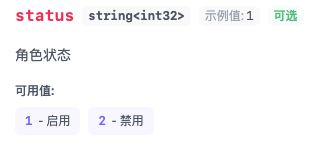

# NextDoc4j 枚举插件使用手册

枚举插件是 nextdoc4j 的核心插件之一，用于在 API 文档中增强枚举类型的展示效果。通过自动解析枚举的 value-description 映射关系，生成更加直观和可读的 OpenAPI 文档。

## 快速开始

### 1. 引入依赖

```xml
<dependency>
  <groupId>top.nextdoc4j</groupId>
  <artifactId>nextdoc4j-plugin-enums</artifactId>
  <version>${nextdoc4j.version}</version>
</dependency>
```

### 2. 在 `application.yml` 中配置：

```yaml
nextdoc4j:
  plugin:
    enum:
      enabled: true
```

### 3. 定义枚举类

实现 `EnumValue<T>` 接口：

```java
/**
 * @param <T> 值类型，支持 Integer、Long、String、Double、Float 等 Serializable 类型
 */
@Getter
@RequiredArgsConstructor
public enum RoleStatusType implements EnumValue<Integer> {

    ACTIVE(1, "启用"),

    INACTIVE(2, "禁用");

    private final Integer value;
    private final String description;
}
```

## 模块结构

### 核心类说明

| 类名                            | 说明      | 作用                      |
|-------------------------------|---------|-------------------------|
| `EnumValue<T>`                | 枚举值接口   | 定义枚举必须实现的方法             |
| `NextDoc4jEnumMetadata`       | 枚举元数据模型 | 存储 value-description 映射 |
| `EnumMetadataResolver`        | 解析器接口   | 支持自定义解析逻辑               |
| `DefaultEnumMetadataResolver` | 默认解析器   | 处理 `EnumValue` 接口枚举     |
| `NextDoc4jEnumUtils`          | 工具类     | 类型转换和反射辅助               |
| `NextDoc4jEnumProperties`     | 配置属性    | 控制插件启用状态                |

## 配置说明

### 基本配置

```yaml
nextdoc4j:
  plugin:
    enum:
      enabled: true
```

| 配置项     | 类型      | 默认值   | 说明       |
|---------|---------|-------|----------|
| enabled | boolean | false | 是否启用枚举插件 |

## 使用示例

### 基础枚举定义

```java
/**
 * 整型枚举示例
 */
public enum RoleStatusType implements EnumValue<Integer> {

    ACTIVE(1, "启用"),
    INACTIVE(2, "禁用");

    private final Integer value;
    private final String description;
}

/**
 * 字符串枚举示例
 */
public enum OrderStatus implements EnumValue<String> {

    PENDING("PENDING", "待支付"),
    PAID("PAID", "已支付"),
    SHIPPED("SHIPPED", "已发货"),
    COMPLETED("COMPLETED", "已完成"),
    CANCELLED("CANCELLED", "已取消");

    private final String value;
    private final String description;
}
```

## 生成的文档效果

配置完成后，访问 nextdoc4j 将看到增强的枚举文档：



### OpenAPI 扩展字段

枚举信息通过 OpenAPI 扩展字段 `x-nextdoc4j-enum` 展示：

```json
{
  "type": "string",
  "enum": ["PENDING", "PAID", "SHIPPED", "COMPLETED", "CANCELLED"],
  "x-nextdoc4j-enum": {
    "items": [
      { "value": "PENDING", "description": "待支付" },
      { "value": "PAID", "description": "已支付" },
      { "value": "SHIPPED", "description": "已发货" },
      { "value": "COMPLETED", "description": "已完成" },
      { "value": "CANCELLED", "description": "已取消" }
    ]
  }
}
```

## 支持的类型

插件自动识别并映射以下 Java 类型到 OpenAPI 类型：

| Java 类型             | OpenAPI Type | OpenAPI Format |
|---------------------|--------------|----------------|
| `Integer` / `int`   | `integer`    | `int32`        |
| `Long` / `long`     | `long`       | `int64`        |
| `String`            | `string`     | -              |
| `Double` / `double` | `number`     | `double`       |
| `Float` / `float`   | `number`     | `double`       |

## 高级特性

### 简化枚举定义

如果枚举不需要自定义描述，可以只实现 `getValue()` 方法：

```java
public enum Priority implements EnumValue<Integer> {

    HIGH(1),
    MEDIUM(2),
    LOW(3);

    private final Integer value;

    Priority(Integer value) {
        this.value = value;
    }

    @Override
    public Integer getValue() {
        return value;
    }

    /**
     * 覆盖 getDescription() 方法，提供自定义描述
     * 如果不覆盖，会使用枚举常量名称作为描述
     */
    @Override
    public String getDescription() {
        switch (this) {
            case HIGH: return "高优先级";
            case MEDIUM: return "中优先级";
            case LOW: return "低优先级";
            default: return this.name();
        }
    }
}
```

### 智能处理机制

**重要特性**：插件会自动检测枚举是否包含自定义描述。如果枚举项的描述与枚举常量名称完全一致，插件将**不会**生成 `x-nextdoc4j-enum` 扩展字段，以保持文档的简洁性。

```java
// ✅ 这种情况会生成扩展字段（description != name）
public enum Status implements EnumValue<Integer> {
    ACTIVE(1, "启用"),
    INACTIVE(2, "禁用");
    // description: "启用" ≠ name: "ACTIVE"
}

// ❌ 这种情况不会生成扩展字段（description == name）
public enum Status implements EnumValue<String> {
    ACTIVE("ACTIVE"),
    INACTIVE("INACTIVE");
    // description: "ACTIVE" == name: "ACTIVE"
```

### 类型推断机制

插件通过反射解析 `EnumValue<T>` 接口的泛型参数，自动推断 OpenAPI 的 `type` 和 `format`：

```java
// 推断为：type: "integer", format: "int32"
public enum IntStatus implements EnumValue<Integer> { ... }

// 推断为：type: "long", format: "int64"
public enum LongStatus implements EnumValue<Long> { ... }

// 推断为：type: "string"
public enum StrStatus implements EnumValue<String> { ... }

// 推断为：type: "number", format: "double"
public enum DoubleStatus implements EnumValue<Double> { ... }
```

### 自定义解析器

如果项目中有特殊的枚举接口或方法命名规范，可以自定义枚举解析器：

```java
/**
 * 自定义业务枚举接口
 */
public interface BusinessEnum {

    /**
     * 获取业务编码
     */
    String getCode();

    /**
     * 获取业务标签
     */
    String getLabel();
}

/**
 * 自定义枚举解析器
 */
@Component
public class BusinessEnumResolver implements EnumMetadataResolver {

    @Override
    public boolean supports(Class<?> enumClass) {
        return enumClass != null
            && enumClass.isEnum()
            && BusinessEnum.class.isAssignableFrom(enumClass);
    }

    @Override
    public Class<?> getEnumInterfaceType() {
        // 指定泛型接口类型，用于提取值类型
        return BusinessEnum.class;
    }

    @Override
    public String getValueMethodName() {
        // 指定获取值的方法名（默认是 getValue）
        return "getCode";
    }

    @Override
    public String getDescriptionMethodName() {
        // 指定获取描述的方法名（默认是 getDescription）
        return "getLabel";
    }

    // 其他方法使用默认实现即可
}
```

使用自定义解析器的枚举：

```java
public enum OrderStatus implements BusinessEnum {

    PENDING("PENDING", "待支付"),
    PAID("PAID", "已支付"),
    SHIPPED("SHIPPED", "已发货");

    private final String code;
    private final String label;

    OrderStatus(String code, String label) {
        this.code = code;
        this.label = label;
    }

    @Override
    public String getCode() {
        return code;
    }

    @Override
    public String getLabel() {
        return label;
    }
}
```

::: tip 解析器优先级
- 插件会按照 Spring 容器中注册的顺序依次尝试解析器
- 第一个 `supports()` 返回 `true` 的解析器将被使用
- 如果没有自定义解析器支持，会自动降级到内置的 `DefaultEnumMetadataResolver`
- 内置解析器支持所有实现了 `EnumValue<T>` 接口的枚举
  :::

### 反射处理特性

插件使用反射机制解析枚举方法，支持以下特性：

1. **自动设置方法可访问性**：解决匿名内部类枚举的访问权限问题
2. **错误容错机制**：单个枚举项解析失败不影响其他项的解析
3. **泛型类型提取**：从接口的泛型参数中准确提取值类型

```java
// 支持匿名内部类枚举
public enum ComplexEnum implements EnumValue<String> {

    VALUE1("value1", "描述1") {
        @Override
        public String getCustomMethod() {
            return "custom1";
        }
    },

    VALUE2("value2", "描述2") {
        @Override
        public String getCustomMethod() {
            return "custom2";
        }
    };

    // 抽象方法由各枚举项实现
    public abstract String getCustomMethod();
}
```

