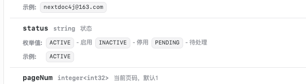
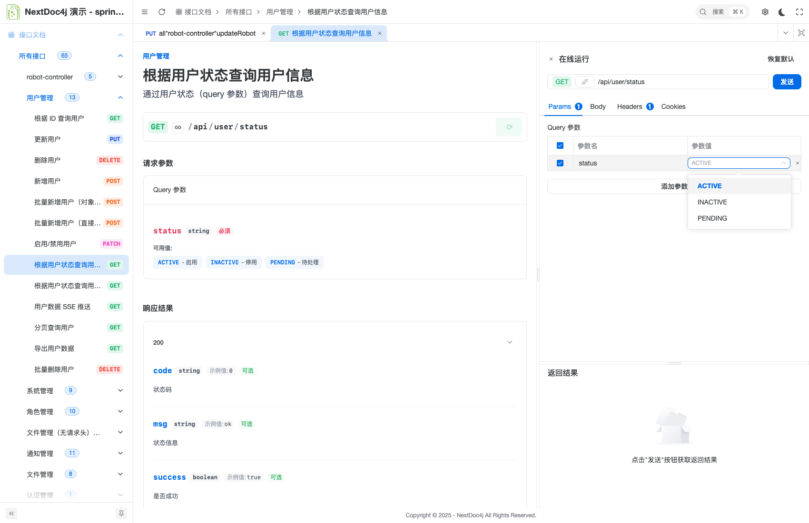

# 枚举展示插件

枚举展示插件用于在 API 文档中增强枚举类型的展示效果，自动解析枚举的 value-description 映射关系。

## UI 适配效果

配置插件后 UI 会在接口调试时自动展示枚举下拉选项，显示枚举值的描述信息：


*▲ 接口调试时自动显示枚举下拉选项*


*▲ 枚举值带描述提示*

## 快速开始

### 1. 引入依赖

```xml
<dependency>
    <groupId>top.nextdoc4j</groupId>
    <artifactId>nextdoc4j-plugin-enums</artifactId>
    <version>${latest.version}</version>
</dependency>
```

### 2. 启用插件

```yaml
nextdoc4j:
  plugin:
    enum:
      enabled: true
```

### 3. 定义枚举

实现 `EnumValue<T>` 接口：

```java
@Getter
@RequiredArgsConstructor
public enum OrderStatus implements EnumValue<String> {

    PENDING("PENDING", "待支付"),
    PAID("PAID", "已支付"),
    SHIPPED("SHIPPED", "已发货"),
    COMPLETED("COMPLETED", "已完成"),
    CANCELLED("CANCELLED", "已取消");

    private final String value;
    private final String description;
}
```

## 模块说明

| 类                             | 说明                                     |
|-------------------------------|----------------------------------------|
| `EnumValue<T>`                | 枚举值接口，定义 getValue() 和 getDescription() |
| `DefaultEnumMetadataResolver` | 默认解析器，处理 EnumValue 接口枚举                |
| `EnumMetadataResolver`        | 自定义解析器接口                               |

## 支持的类型

| Java 类型             | OpenAPI Type | OpenAPI Format |
|---------------------|--------------|----------------|
| `Integer` / `int`   | `integer`    | `int32`        |
| `Long` / `long`     | `integer`    | `int64`        |
| `String`            | `string`     | -              |
| `Double` / `double` | `number`     | `double`       |
| `Float` / `float`   | `number`     | `double`       |

## 自定义解析器

如需支持其他枚举接口，实现 `EnumMetadataResolver`：

```java
@Component
public class BusinessEnumResolver implements EnumMetadataResolver {

    @Override
    public boolean supports(Class<?> enumClass) {
        return enumClass != null
            && enumClass.isEnum()
            && BusinessEnum.class.isAssignableFrom(enumClass);
    }
    
    @Override
    public Class<?> getEnumInterfaceType() {
      return BusinessEnum.class;
    }

    @Override
    public String getValueMethodName() {
        return "getCode";  // 自定义获取值的方法名
    }

    @Override
    public String getDescriptionMethodName() {
        return "getLabel";  // 自定义获取描述的方法名
    }
}
```

## OpenAPI 输出效果

```json
{
  "status": {
    "type": "string",
    "enum": ["PENDING", "PAID", "SHIPPED", "COMPLETED", "CANCELLED"],
    "x-nextdoc4j-enum": {
      "items": [
        { "value": "PENDING", "description": "待支付" },
        { "value": "PAID", "description": "已支付" },
        { "value": "SHIPPED", "description": "已发货" },
        { "value": "COMPLETED", "description": "已完成" },
        { "value": "CANCELLED", "description": "已取消" }
      ]
    }
  }
}
```

nextdoc4j UI 会读取 `x-nextdoc4j-enum` 扩展字段，在调试时下拉展示枚举值及其描述。
