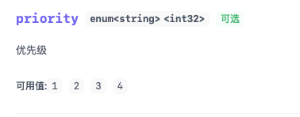

# 枚举插件

NextDoc4j 枚举插件让 UI 中的枚举参数更加易读易用。它会自动提取枚举的值和中文描述，在接口文档中清晰展示每个枚举值代表的业务含义，让前后端开发者一目了然。

## 功能特性

- **清晰展示枚举含义**：在 UI 中显示 "1 - 启用"、"2 - 禁用" 这样的可读格式
- **自动识别枚举**：自动检测实现 `EnumValue` 接口的枚举类型
- **丰富的文档信息**：支持枚举值、类型、格式和描述的完整文档化
- **扩展性强**：通过自定义 `EnumMetadataResolver` 支持任意枚举接口
- **零侵入**：基于 SpringDoc 扩展机制，无需修改现有代码
- **智能类型推断**: 自动识别枚举值类型（Integer、String 等）并生成对应的 schema

## 快速开始

### 1. 添加依赖

```xml
<dependency>
    <groupId>top.nextdoc4j</groupId>
    <artifactId>nextdoc4j-enum-plugin</artifactId>
    <version>${nextdoc4j.version}</version>
</dependency>
```

### 2. 启用插件

在 `application.yml` 中配置：

```yaml
nextdoc4j:
  plugin:
    enum:
      enabled: true
```

### 3. 定义枚举类

实现 `EnumValue<T>` 接口：

```java
@Getter
@RequiredArgsConstructor
public enum RoleStatusType implements EnumValue<Integer> {


    ACTIVE(1, "启用"),

    INACTIVE(2, "禁用");

    private final Integer value;
    private final String description;
}
```

## 生成的文档效果

配置完成后，访问 nextdoc4j 将看到增强的枚举文档：


## 支持的值类型

插件自动识别并映射以下 Java 类型到 OpenAPI 类型：

| Java 类型             | OpenAPI Type | OpenAPI Format |
|---------------------|--------------|----------------|
| `Integer` / `int`   | `integer`    | `int32`        |
| `Long` / `long`     | `long`       | `int64`        |
| `String`            | `string`     | -              |
| `Double` / `double` | `number`     | `double`       |
| `Float` / `float`   | `number`     | `double`       |

### 示例：字符串类型枚举

```java
public enum OrderStatus implements EnumValue<String> {
    
    PENDING("PENDING", "待支付"),
    PAID("PAID", "已支付"),
    SHIPPED("SHIPPED", "已发货"),
    COMPLETED("COMPLETED", "已完成"),
    CANCELLED("CANCELLED", "已取消");
    
    private final String value;
    private final String description;
}
```

生成的 Schema：

```json
{
  "type": "string",
  "enum": ["PENDING", "PAID", "SHIPPED", "COMPLETED", "CANCELLED"],
  "x-nextdoc4j-enum": {
    "items": [
      { "value": "PENDING", "description": "待支付" },
      { "value": "PAID", "description": "已支付" },
      { "value": "SHIPPED", "description": "已发货" },
      { "value": "COMPLETED", "description": "已完成" },
      { "value": "CANCELLED", "description": "已取消" }
    ]
  }
}
```

## 高级特性

### 简化枚举定义

如果枚举不需要自定义描述，可以只实现 `getValue()` 方法：

```java
public enum Priority implements EnumValue<Integer> {
    
    LOW(1),
    MEDIUM(2),
    HIGH(3),
    URGENT(4);
    
    private final Integer value;
    
    Priority(Integer value) {
        this.value = value;
    }
    
    @Override
    public Integer getValue() {
        return value;
    }
    
    // getDescription() 使用默认实现，返回枚举常量名称
}
```

生成的文档：


::: info
当所有枚举项的描述都等于枚举常量名称时，插件会自动省略 `x-nextdoc4j-enum` 扩展字段，保持文档简洁。
:::

## 自定义枚举解析器

如果你的项目使用自定义的枚举接口，可以实现 `EnumMetadataResolver` 进行扩展。

### 1. 定义自定义枚举接口

```java
/**
 * 自定义业务枚举接口
 */
public interface BusinessEnum<T> {
    T getCode();
    String getLabel();
}
```

### 2. 实现自定义解析器

```java
import org.springframework.stereotype.Component;
import top.nextdoc4j.enums.resolver.EnumMetadataResolver;

@Component
public class BusinessEnumResolver implements EnumMetadataResolver {
    
    @Override
    public boolean supports(Class<?> enumClass) {
        return enumClass != null 
            && enumClass.isEnum() 
            && BusinessEnum.class.isAssignableFrom(enumClass);
    }
    
    @Override
    public Class<?> getEnumInterfaceType() {
        // 指定泛型接口类型，用于提取值类型
        return BusinessEnum.class;
    }
    
    @Override
    public String getValueMethodName() {
        // 指定获取值的方法名
        return "getCode";
    }
    
    @Override
    public String getDescriptionMethodName() {
        // 指定获取描述的方法名
        return "getLabel";
    }
    
    // 其他方法使用默认实现即可
}
```

::: tip 解析器优先级
- 插件会按照 Spring 容器中注册的顺序依次尝试解析器
- 第一个 `supports()` 返回 `true` 的解析器将被使用
- 如果没有自定义解析器支持，会自动降级到内置的 `DefaultEnumMetadataResolver`
  :::

## 配置选项

### 完整配置示例

```yaml
nextdoc4j:
  plugin:
    enum:
      # 是否启用枚举插件
      enabled: true
```

::: warning 注意
目前插件仅提供 `enabled` 配置项。更多配置选项将在后续版本中添加。
:::

