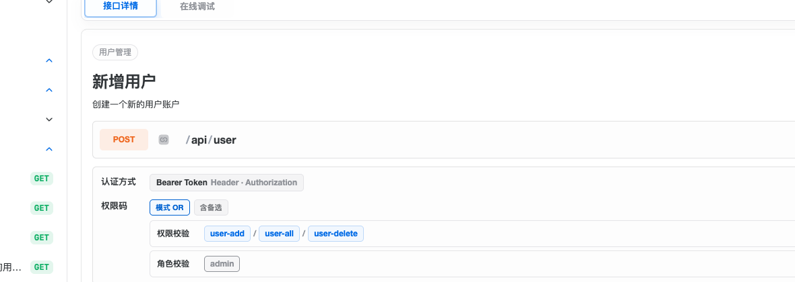
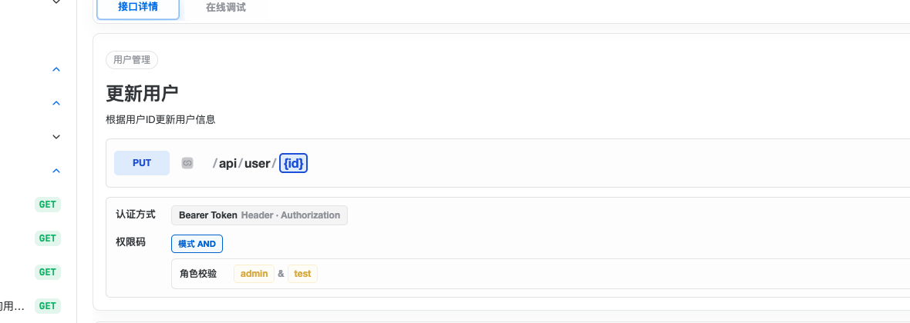

# Sa-Token 权限码插件

Sa-Token 权限码插件用于解析 `@SaCheckPermission` 等权限注解，在接口调试时动态添加权限码请求头。

## nextdoc4j UI 适配效果

配置插件后，nextdoc4j UI 会在接口详情显示权限码：


*▲ SaCheckPermission 注解*


*▲ SaCheckRole 注解*

## 快速开始

### 1. 引入依赖

```xml
<dependency>
    <groupId>top.nextdoc4j</groupId>
    <artifactId>nextdoc4j-plugin-security-satoken</artifactId>
    <version>${nextdoc4j.version}</version>
</dependency>
```

### 2. 启用插件

```yaml
nextdoc4j:
  plugin:
    security:
      enabled: true
```

### 3. 使用权限注解

```java
@RestController
public class UserController {

    @SaCheckPermission("user:read")
    @GetMapping("/api/user/{id}")
    public User getUserById(@PathVariable Long id) {}

    @SaCheckRole("admin")
    @PostMapping("/api/user")
    public User createUser(@RequestBody User user) {}

    @SaCheckPermission(value = {"user:update", "user:delete"}, mode = SaMode.OR)
    @PutMapping("/api/user/{id}")
    public User updateUser(@PathVariable Long id, @RequestBody User user) {}

    @SaIgnore
    @GetMapping("/api/user/public")
    public User getPublicUser() {}
}
```

## 支持的注解

| 注解 | 说明 |
|-----|-----|
| `@SaCheckPermission` | 权限校验 |
| `@SaCheckRole` | 角色校验 |
| `@SaIgnore` | 忽略校验 |

## OpenAPI 输出效果

解析后的权限信息会添加到 OpenAPI 扩展字段：

```json
{
  "paths": {
    "/api/user/{id}": {
      "get": {
        "x-nextdoc4j-security": {
          "permissions": [
            { "values": ["user:read"], "mode": "AND", "type": "permission" }
          ],
          "roles": [],
          "ignore": false
        }
      }
    }
  }
}
```

nextdoc4j UI 会读取 `x-nextdoc4j-security` 扩展字段，在调试时显示权限码输入框，并动态拼接权限码参数。
